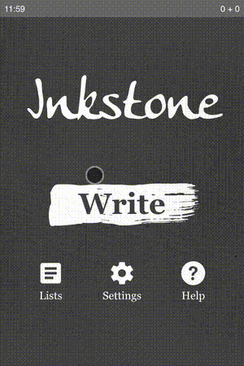

### Introduction

Inkstone is a mobile-friendly web app for people who want to learn to read and
write Mandarin. It's **totally free**, **open-source**, and can be used
**without an Internet connection**! Inkstone is licensed under the
[GNU General Public License v3.0](https://www.gnu.org/licenses/gpl-3.0.en.html).
It has quite a few features:

- Tap for a hint, double-tap for a walkthrough
- Stroke recognition and automatic grading
- Spaced-repetition-based scheduling
- Help pages and stroke-order animations for every character
- Bundled word lists: radicals and all HSK levels
- Settings that give you control over scheduling
- Support for custom word lists

### Project History & Fork Notice

This project is a modern fork of the original [Inkstone app by Shaunak Kishore](https://github.com/skishore/inkstone). 

**What changed:**
The original project was built using the Meteor framework and wrapped as an Android app using Cordova. This modernized version was completely rewritten by **Juhász Péter Károly** (with the help of Antigravity and DeepSeek) to ditch the heavy legacy dependencies (Meteor, Cordova, jQuery, Underscore) and port the application to a lightning-fast, lightweight **Vite + Preact** Progressive Web App (PWA).

All user data and spaced-repetition progress is now stored securely in the browser using IndexedDB. The app can be installed directly to your phone's home screen from the browser and works fully offline.

### Building and Running from Source

To build and run Inkstone, you will need [Node.js](https://nodejs.org/) installed on your machine.

1. Clone the repository and install dependencies:
```bash
npm install
```

2. Start the local development server:
```bash
npm run dev
```

3. Build the production application:
```bash
npm run build
```
This will generate a `dist/` directory containing the purely static HTML/JS/CSS files. You can host this `dist/` folder on any web server (Nginx, Apache, GitHub Pages, Vercel, etc.) and it will function perfectly.

### Open source credits

Inkstone was made possible by a number of other open-source projects:

* **MeteorJS**
  - Copyright 2011-2016 Meteor Development Group.
  - Licensed under the MIT License.
  - [https://www.meteor.com/](https://www.meteor.com/)
* **Apache Cordova**
  - Copyright 2012, 2013, 2015 The Apache Software Foundation.
  - Licensed under the Apache License Version 2.0.
  - [https://cordova.apache.org/](https://cordova.apache.org/)
* **Arphic PL KaitiM GB and UKai**
  - Copyright 1999 Arphic Technology Co., Ltd.
  - Licensed under the Arphic Public License.
  - [http://www.arphic.com.tw/en/home/index](http://www.arphic.com.tw/en/home/index)
* **Make Me a Hanzi**
  - Copyright 1999 Arphic Technology Co., Ltd.; Copyright 2016 Shaunak Kishore.
  - Licensed under the Arphic Public License.
  - [https://github.com/skishore/makemeahanzi](https://github.com/skishore/makemeahanzi)
* **100 Common Radicals**
  - Copyright 2012 Olle Linge.
  - Free for use with attribution.
  - [http://www.hackingchinese.com/kickstart-your-character-learning-with-the-100-most-common-radicals/](http://www.hackingchinese.com/kickstart-your-character-learning-with-the-100-most-common-radicals/)
* **New HSK Word Lists**
  - Copyright 2014 alan@hskhsk.com.
  - Free to be copied, distributed, or modified for non-commercial use.
  - [http://www.hskhsk.com/word-lists.html](http://www.hskhsk.com/word-lists.html)
* **JavaScript MD5**
  - Copyright 2011, Sebastian Tschan.
  - Licensed under the MIT License.
  - [https://github.com/blueimp/JavaScript-MD5](https://github.com/blueimp/JavaScript-MD5)
* **CreateJS**
  - Copyright 2014 gskinner.com, inc.
  - Licensed under the MIT License.
  - [http://createjs.com/](http://createjs.com/)
* **Ionicons**
  - Copyright 2016 Drifty.
  - Licensed under the MIT License.
  - [http://ionicons.com/](http://ionicons.com/)
* **Skritter HTML5**
  - Copyright 2015 Inkren Inc.
  - Licensed under the MIT License.
  - [https://github.com/skritter/skritter-html5](https://github.com/skritter/skritter-html5)
* **Meteoric**
  - Copyright 2015 Nick Wientge.
  - Licensed under the MIT License.
  - [https://github.com/meteoric/meteor-ionic](https://github.com/meteoric/meteor-ionic)

